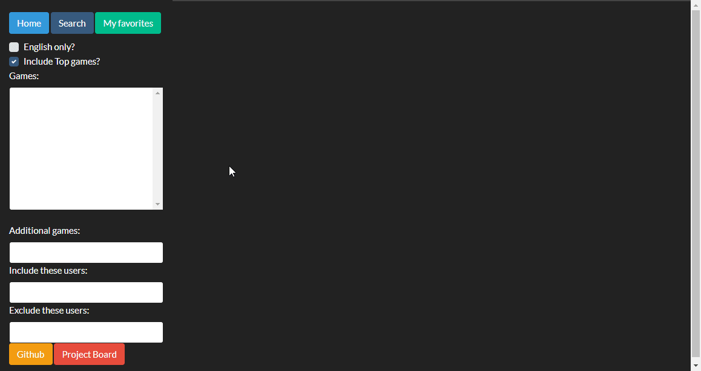
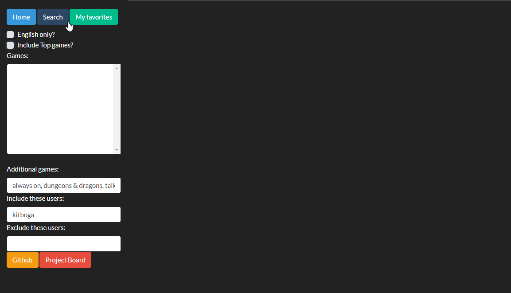
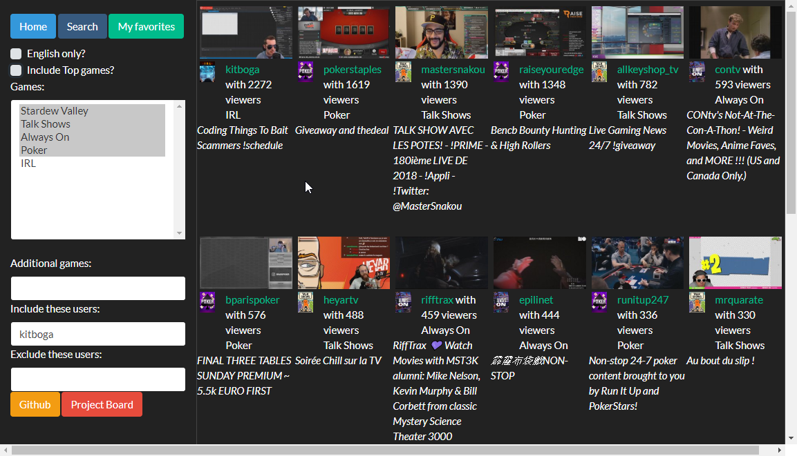
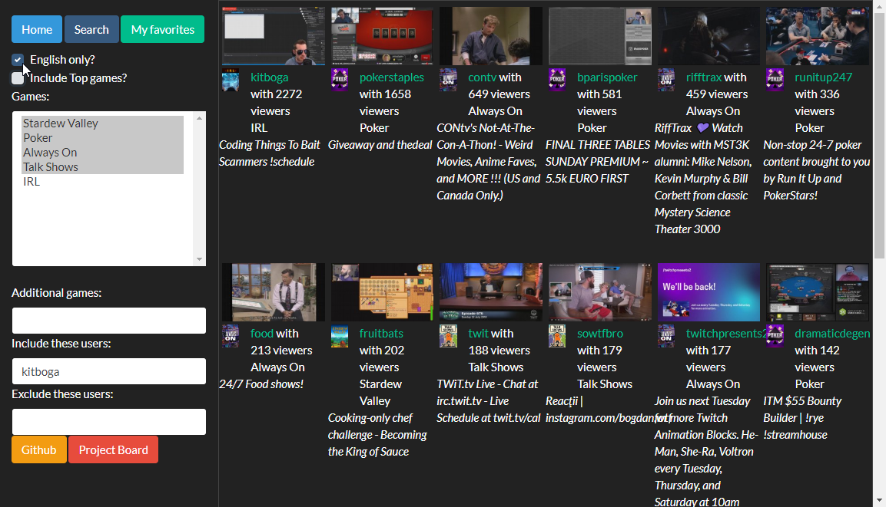
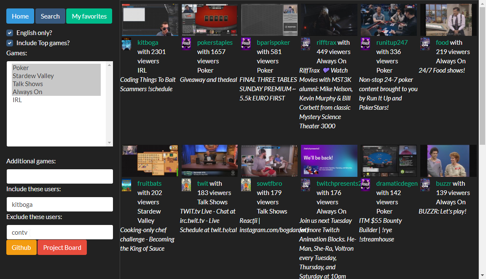
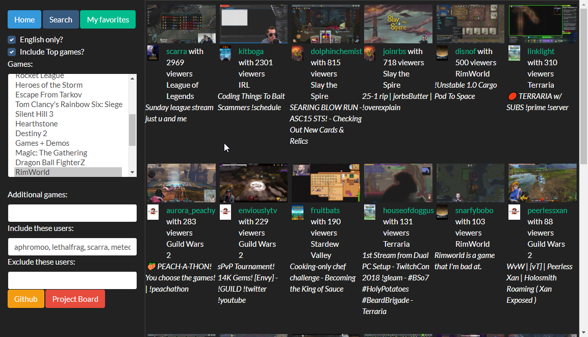

# Multigame_Browser

## Primer for those unfamiliar with Twitch:
Twitch.tv is a website where anyone can live-stream things. Primarily focused around video games, but you also have [Art and other creative avenues](https://www.twitch.tv/directory/creative), physical card games like [Old-fashioned poker](https://www.twitch.tv/directory/game/Poker) and [Magic: the Gathering](https://www.twitch.tv/directory/game/Magic%3A%20The%20Gathering), [Pen-and-paper RPGs like Dungeons and Dragons](https://www.twitch.tv/directory/game/Dungeons%20%26%20Dragons), [Talk shows/podcasts](https://www.twitch.tv/directory/game/Talk%20Shows), [a 24/7 stream of cooking shows](https://www.twitch.tv/food), and a smorgasbord called [IRL](https://www.twitch.tv/directory/game/IRL) where people do all sorts of weird stuff - even just broadcasting them walking around in different cities.

Many streams have a high level of interaction between the streamers and the viewers - though it varies by streamer (as well as what they're doing at the time).

Most streamers are individuals doing their own thing. But there are also multi-million-dollar companies who organize professional broadcasts exactly how TV stations do it. In fact, some events are simul-cast on live TV and on Twitch. Many of these company streams are for competitive gaming, but not all.

There are some people who stream every day on set schedules, just like a standard job. There are others who decide to randomly turn on their streams here and there. 

One of the most popular everyday streamers is named [Ninja](https://www.twitch.tv/Ninja), and he usually has about 150,000 concurrent viewers at any given time. He's definitely the exception to the rule, but these numbers are nothing to scoff at. If you look at the [Main Twitch directory](https://www.twitch.tv/directory/all), you'll usually see that the top 15 streamers are all over 10,000 concurrent viewers. Some bigger events can bring in many hundreds of thousands of concurrent viewers.

I grew up in a time when all of my friends loved games, but we had never realistically thought you could make a living out of playing them (and our parents definitely didn't). Twitch has proven that to no longer be the case.

Given that there are so many people broadcasting what they're doing, and such a huge variety of things _to_ broadcast, and so many active users browsing through this all, you need a robust way to find what you truly want to watch.
Twitch provides the following directory types:
* The top streamers across all games (https://www.twitch.tv/directory/all)
* The top streamers for 1 given game (https://www.twitch.tv/directory/game/Overwatch)
* The specific streamers you follow, across all games (https://www.twitch.tv/directory/following/live)
* A list of games that you follow (https://www.twitch.tv/directory/following/games)

And that can be great. If there is a game that I love, I can check in on it very easily. Or if there are very specific people I'm interested in, I can quickly see what they're doing. Or if I just want to see what's super possible, I can do that.
You can also filter streamers by language - if you don't speak French, you're not likely to be interested in seeing French streamers.

But there are a lot of gaps left there. In some cases, it's about information being too spread out. In others, it's about having too much noise-to-signal ratio.
* I want to be able to view all the streamers for the games that I like, at one time
* There are certain streamers who I really dislike, and I don't want to see their content
* There are certain games I have zero interest in, and don't need to see them listed
* I prefer to see only English streamers, but if there are none, give me whatever else there is

These are all things that I want to resolve with this project. 

## Browsing with this new directory
### Here is a .gif of the directory in action: 

### Here is usage broken down into individual images:
The current "base" screen, if you navigate to the home:

Typing in some search options, before submitting the search: 

Results of the search:

Modifying the search to only return English streams:

Modifying the search to exclude a certain user:

Using the "My Favorites" button to use a pre-defined set of search options:

## For developers who want to try this on their own
If you pull down this repo and make use of it for yourself, you need to create a `keys.js` file in the root directory, with the following details:

    module.exports = {
        db: {
            user: 'ADMIN',
            password: 'SECRET'
        },
    
        twitch: {
            'Client-ID': 'KEY',
            'Authorization': 'Bearer KEY'
        },
    
        youtube: {
            'API-Key': 'KEY'
        }
    };
Replacing KEY with the appropriate key.
Update Node and install all packages
Run via `npm run dev`
View at localhost:3000

