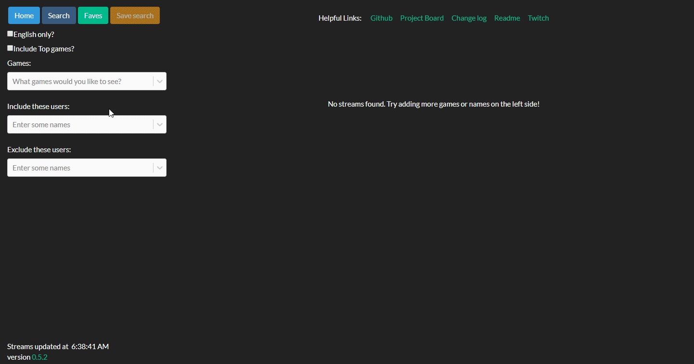

# Multigame Browser

## Quick Links

[Try it out now!](https://multigame-browser.herokuapp.com/) (or [this link](https://multigame-browser.herokuapp.com/?include_top=false&language=en&name=albinoliger&name=aphromoo&name=day9tv&name=kitboga&name=lethalfrag&name=scarizardplays&exclude=tynansylvester&exclude=concernedape&exclude=colossalorder&exclude=motiontwin&game=Stardew%20Valley&game=RimWorld&game=Cities:%20Skylines&game=Dead%20Cells) which has some pre-defined data, to see it in action) - If the website takes a while to load, just give it ~15 seconds. This is a limitation of Heroku's free service unfortunately.

[Changelog](https://github.com/ksnovak/Multigame_Browser/blob/master/CHANGELOG.md) - See what I've added or removed recently.

If you're unfamiliar with Twitch, scroll on down to the ["What is Twitch?"](#what-is-twitch) section

## What is this app?

This effectively replaces the main Twitch directory, by giving you a combination of multiple searches within a single screen. You can get results for certain games and specific users within the same search, as well as filtering out certain users you are uninterested in.

An example use case:

I follow a few streamers, and am interested in a few games. There are also a few people who regularly stream those games that I already know I'm not interested in viewing.
I can have a single search that gets exactly those results, such as [this one](https://multigame-browser.herokuapp.com/?include_top=false&language=en&name=albinoliger&name=aphromoo&name=day9tv&name=kitboga&name=lethalfrag&name=scarizardplays&exclude=tynansylvester&exclude=concernedape&exclude=colossalorder&exclude=motiontwin&game=Stardew%20Valley&game=RimWorld&game=Cities%3A%20Skylines&game=Dead%20Cells)

When browsing Twitch directly, I would need to look at my list of followed streamers, and also individually visit each of those games' directories in order to see all of that information. Twitch also has no way to hide users that you are uninterested in.

Additionally, if there is a set of streamers and games that you regularly find yourself searching for, you have the ability with this site to save that as a favorite search, so you can immediately go back to looking at them as soon as you open the site back up (or just after you're done searching for other things).

## How to use the browser

## What is Twitch?

Perhaps Twitch can explain themselves best: https://www.twitch.tv/p/about/

Twitch.tv is the 14th most popular site in the US according to the [Alexa rankings](https://www.alexa.com/topsites/countries/US). It's a place where anyone can live-stream their hobbies. Primarily used for video games, but you can find all sorts of things:

- [Art](https://www.twitch.tv/directory/game/Art)
- physical card games like [Old-fashioned poker](https://www.twitch.tv/directory/game/Poker) and [Magic: the Gathering](https://www.twitch.tv/directory/game/Magic%3A%20The%20Gathering)
- [Pen-and-paper RPGs like Dungeons and Dragons](https://www.twitch.tv/directory/game/Dungeons%20%26%20Dragons)
- [Talk shows/podcasts](https://www.twitch.tv/directory/game/Talk%20Shows)
- [a 24/7 stream of cooking shows](https://www.twitch.tv/food)
- [Music-makers](https://www.twitch.tv/directory/game/Music%20%26%20Performing%20Arts)

and beyond.

The big draw of Twitch is the interaction. It's (usually) not a one-way broadcast like TV, the streamers usually interact heavily with their viewers.

Streams vary from your average person randomly deciding to show off their gameplay to 4 of their friends some night, to multi-million dollar gaming tournaments, to individuals who stream every day with dozens of thousands of simultaneous viewers every time.
